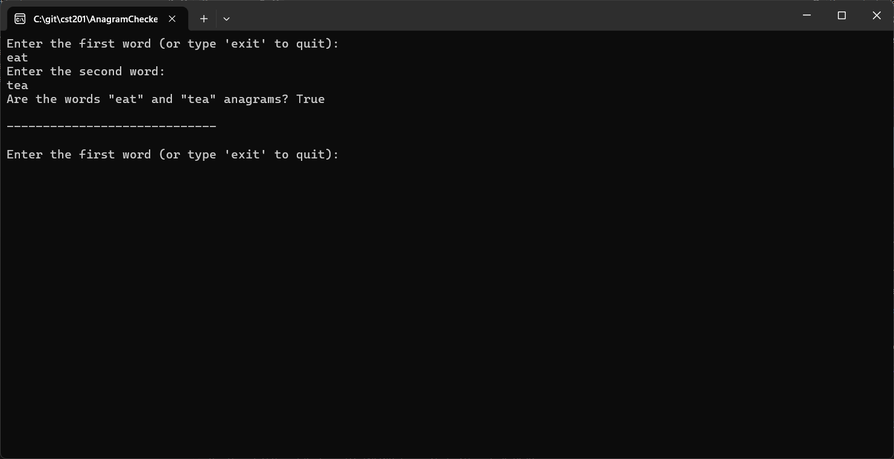
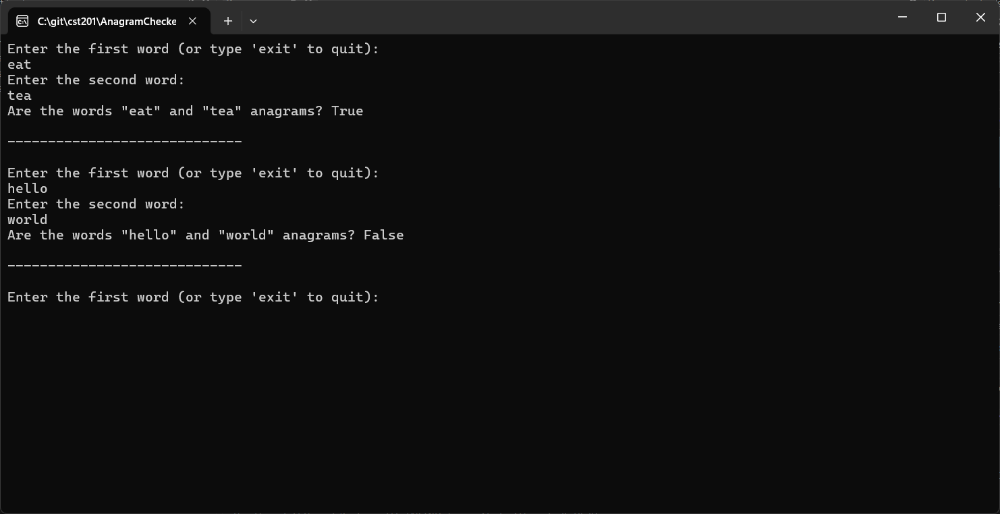
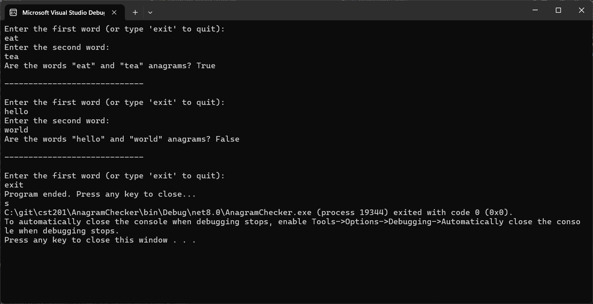

# Activity 1 Introduction

---

# 📝 Cover Sheet
**Student Name:** Alex Frear  
**Date:** 01/14/2025  
**Program:** College of Science, Engineering, and Technology, Grand Canyon University  
**Course:** CST-201 Algorithms and Data Structures  
**Instructor:** Mohamed Mneimneh  

---

## 🎥 **Screencast Video**
<div>
    <a href="https://www.loom.com/share/8228966772994e689cddbcae143b74be">
      <p>CST 201 - Activity 1 - Watch Video</p>
    </a>
    <a href="https://www.loom.com/share/8228966772994e689cddbcae143b74be">
      
    </a>
  </div>

---

# 📋 Anagram Checker Program

## 📄 **Description**
This project is an Anagram Checker built as part of the CST-201 Algorithms and Data Structures course. The program takes two words as input from the user and checks if they are anagrams. An anagram is a word formed by rearranging the letters of another word (e.g., "listen" and "silent").

The program keeps running until the user decides to exit by typing `exit`. It also handles different test cases to demonstrate the outputs for both positive and negative scenarios.

---

## 📄 **Pseudocode**
```
1. Input two words from the user: word1 and word2.
2. Check if the lengths of word1 and word2 are equal.
   - If not equal, return false (not anagrams).
3. Convert both words to lowercase (to make it case-insensitive).
4. Sort the characters of both words.
5. Compare the sorted versions of word1 and word2.
   - If they are equal, return true (anagrams).
   - Otherwise, return false.
```

---

## 📄 **Source Code**
You can view the full source code for the Anagram Checker program here:  
🔗 [Program.cs](https://github.com/amfrear/cst201/blob/main/AnagramChecker/Program.cs)

---

## 🛠️ **How the Program Works**
The program follows three key steps to check if two words are anagrams:
1. Checks if the lengths of both words are equal.
2. Converts both words to lowercase for case-insensitive comparison.
3. Sorts the letters in both words and compares them. If the sorted versions are identical, the program returns `True`. Otherwise, it returns `False`.

---

## 💻 **How to Run the Program**
### Steps:
1. Open the project in **Visual Studio**.
2. Run the program by pressing **F5**.
3. Enter two words when prompted.
4. The program will display whether the words are anagrams.
5. Type `exit` to quit the program.

---

## 📸 **Screenshots**

### ✅ **Positive Case:**


*This screenshot shows the program identifying that the words "eat" and "tea" are anagrams, returning `True`.*

---

### ❌ **Negative Case:**


*This screenshot shows the program identifying that the words "hello" and "world" are not anagrams, returning `False`.*

---

### 🛑 **Exit the Program:**


*This screenshot shows the program allowing the user to exit by typing "exit." The console then displays a message confirming that the program has ended.*

---

## 📚 **Summary of Key Concepts**
This project demonstrates several important concepts in algorithms and data structures, including:

### 🔑 **1. String Manipulation**
- The program takes two string inputs and processes them by converting them to lowercase, sorting their characters, and comparing the results to check if they are anagrams.

### 🔑 **2. Sorting Algorithm**
- Sorting the characters in each word is a crucial step in determining if the two words are anagrams. The program uses the built-in sorting method, which is based on an efficient sorting algorithm like **Timsort**.

### 🔑 **3. Looping and Conditional Logic**
- The program runs inside a **while loop**, allowing users to repeatedly check different word pairs until they type `exit` to quit the program. This demonstrates the concept of **infinite loops** and **conditional break statements**.

### 🔑 **4. Time Complexity**
- The program’s time complexity is primarily determined by the sorting step, which has a complexity of **O(n log n)**, where `n` is the length of the word. This ensures the program runs efficiently even for longer input words.

---

## 🔧 **How to Modify the Program**
If you want to modify the program to check for different conditions (e.g., ignoring spaces or special characters), you can update the **`AreAnagrams`** method to include additional logic.
