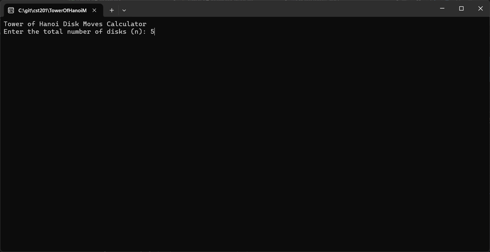
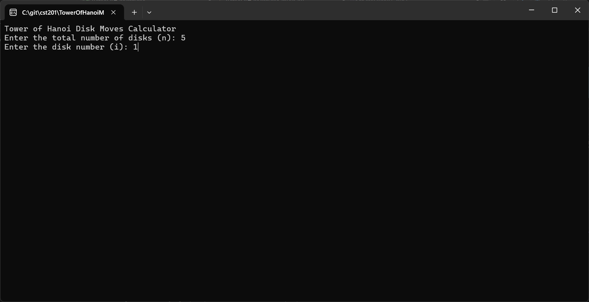
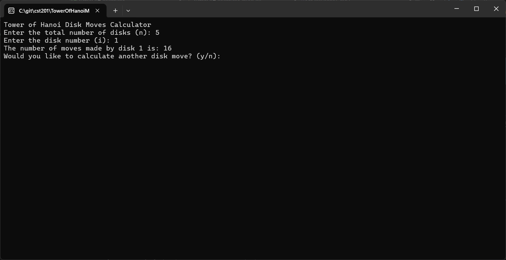

# Activity 2: Complexity

---

# 📝 Cover Sheet  
**Student Name:** Alex Frear  
**Date:** 01/20/2025  
**Program:** College of Science, Engineering, and Technology, Grand Canyon University  
**Course:** CST-201 Algorithms and Data Structures  
**Instructor:** Mohamed Mneimneh  

---

## 🎥 **Screencast Video**
<div>
    <a href="https://www.loom.com/share/5732114266f14db689bdba27e4c7e14b">
      <p>Activity 2 Complexity - Tower of Hanoi - Watch Video</p>
    </a>
    <a href="https://www.loom.com/share/5732114266f14db689bdba27e4c7e14b">
      
    </a>
  </div>

---

# 📋 Tower of Hanoi Disk Moves Calculator

## 📄 **Description**
This project calculates the number of moves made by a specific disk in the Tower of Hanoi problem. The program uses the mathematical formula \( 2^{n-i} \), where `n` is the total number of disks and `i` is the disk number (1 being the smallest disk). 

The program allows users to test multiple scenarios by repeatedly entering different numbers of disks and specific disk numbers. It demonstrates the recursive nature of the Tower of Hanoi problem in an easy-to-understand way.

---

## 📄 **Pseudocode**
```
1. Start the program.
2. Loop:
   a. Prompt the user to enter the total number of disks (n).
   b. If input is invalid, ask again.
   c. Prompt the user to enter the disk number (i).
   d. If input is invalid, ask again.
   e. Validate that i is between 1 and n.
   f. Calculate the number of moves using the formula 2^(n-i).
   g. Display the result.
3. Ask the user if they want to continue.
4. If the user enters "y", repeat. Otherwise, exit the program.
5. End the program.
```

---

## 📄 **Source Code**
You can view the full source code for the Tower of Hanoi Disk Moves Calculator program here:  
🔗 [Program.cs](https://github.com/amfrear/cst201/blob/main/Activity2Complexity/TowerOfHanoiMoves/Program.cs)

---

## 🛠️ **How the Program Works**
The program allows the user to:
1. Input the total number of disks (`n`) and the specific disk number (`i`).
2. Calculate the number of moves the specified disk makes during the Tower of Hanoi solution using \( 2^{n-i} \).
3. Run multiple scenarios without restarting the program.

It validates inputs, ensuring:
- `n` is a positive integer.
- `i` is between 1 and `n`.

If invalid inputs are entered, the program prompts the user to re-enter correct values.

---

## 💻 **How to Run the Program**
### Steps:
1. Open the project in **Visual Studio**.
2. Run the program by pressing **F5**.
3. Enter the total number of disks when prompted.
4. Enter the specific disk number when prompted.
5. The program will display the number of moves the specified disk makes.
6. Enter `y` to calculate another scenario or `n` to exit the program.

---

## 📸 **Screenshots**

### ✅ **Enter Total Number of Disks**


*The program prompts the user to input the total number of disks (`n`).*

---

### ✅ **Enter Specific Disk Number**


*The program asks for the specific disk number (`i`) to calculate the number of moves.*

---

### ✅ **Display Calculated Moves**


*The program calculates and displays the number of moves for the specified disk.*

---

## 📚 **Summary of Key Concepts**
This project demonstrates several important concepts in algorithms and data structures, including:

### 🔑 **1. Mathematical Patterns in Algorithms**
- The Tower of Hanoi follows a recursive pattern. Each disk's movement can be calculated using \( 2^{n-i} \), which simplifies the complex recursive algorithm.

### 🔑 **2. Input Validation**
- The program ensures valid inputs to prevent runtime errors and incorrect calculations.

### 🔑 **3. User-Friendly Features**
- Allows users to repeatedly test multiple scenarios without restarting the program.

### 🔑 **4. Time Complexity**
- The formula \( 2^{n-i} \) ensures efficient computation for any number of disks. The program's complexity is **O(1)** for each calculation, as it directly evaluates the formula.

---

## 🔧 **How to Modify the Program**
If you want to expand the program, consider:
- Adding error messages for non-integer inputs.
- Extending functionality to calculate the total number of moves for the entire Tower of Hanoi problem.

---
