# Activity 3: Battleship Game with AI

---

# 📝 Cover Sheet  
**Student Name:** Alex Frear  
**Date:** 01/24/2025  
**Program:** College of Science, Engineering, and Technology, Grand Canyon University  
**Course:** CST-201 Algorithms and Data Structures  
**Instructor:** Mohamed Mneimneh  

---

## 🎥 **Screencast Video**
<div>
    <a href="https://www.loom.com/share/YOUR_VIDEO_LINK">
      <p>Activity 3: Battleship Game with AI - Watch Video</p>
    </a>
    <a href="https://www.loom.com/share/YOUR_VIDEO_LINK">
      
    </a>
</div>

---

# 📋 Battleship Game with AI

## 📄 **Description**
This project is a console-based implementation of the Battleship game with an AI opponent. The game includes:
- **Player Ship Placement**: Players manually place their ships on the grid.
- **Turn-Based Gameplay**: Players and the computer take turns attacking. **The player gets to go again after scoring a hit and continues attacking until they miss.**
- **AI Mechanics**: The computer uses a state-based AI to "hunt" and "target" ships once it gets a hit.
- **Win/Loss Conditions**: The game ends when either the player's or computer's fleet is completely sunk.

The computer's AI enhances gameplay by dynamically transitioning between states: `Hunt`, `TargetOneHit`, and `OrientationLocked`. This approach simulates a strategic opponent.

---

## 📄 **Pseudocode**
### High-Level Game Flow:
```
1. Initialize the game boards for the player and computer.
2. Player places their ships manually.
3. Computer places its ships randomly.
4. Alternate turns between the player and computer:
   a. Player attacks the computer’s board.
      - If the player scores a hit, they attack again.
      - If the player misses, the turn switches to the computer.
   b. Computer attacks the player’s board using AI mechanics.
5. Repeat until one player's ships are all sunk.
6. Declare the winner and exit.
```

---

## 📄 **Source Code**
You can view the full source code for the Battleship game program here:  
🔗 [Program.cs](https://github.com/amfrear/cst201/blob/main/Activity3BattleshipGame/BattleshipGame/Program.cs)

---

## 🛠️ **How the Program Works**
1. The game starts by initializing two 10x10 grids for the player and the computer.
2. The player places their ships manually, selecting coordinates and orientation.
3. The computer places its ships randomly using a `Random` generator.
4. Gameplay alternates between the player and the computer:
   - The **player** selects attack coordinates, and the result (hit/miss) is displayed. The player continues attacking after scoring a hit until they miss.
   - The **computer** uses AI to attack:
     - **Hunt Mode**: Randomly selects an untried cell.
     - **Target Mode**: Targets cells around a hit until a ship's orientation is determined.
     - **Locked Orientation Mode**: Attacks along the determined ship orientation.
5. The game ends when one side's ships are all sunk.

---

## 💻 **How to Run the Program**
### Steps:
1. Open the project in **Visual Studio**.
2. Run the program by pressing **F5**.
3. Follow the prompts to place your ships and take turns attacking.
4. The game displays a visual representation of both the player’s and the computer’s boards.
5. The game ends when either the player or computer wins.

---

## 📸 **Screenshots**

### ✅ **1. Welcome Screen**
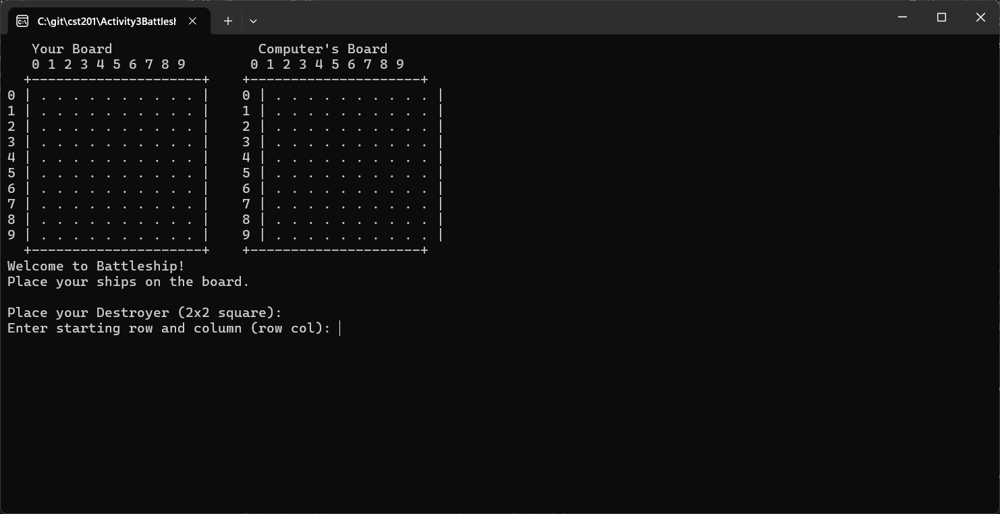

*The game begins with a welcome screen and instructions.*

---

### ✅ **2. Player Ship Placement**
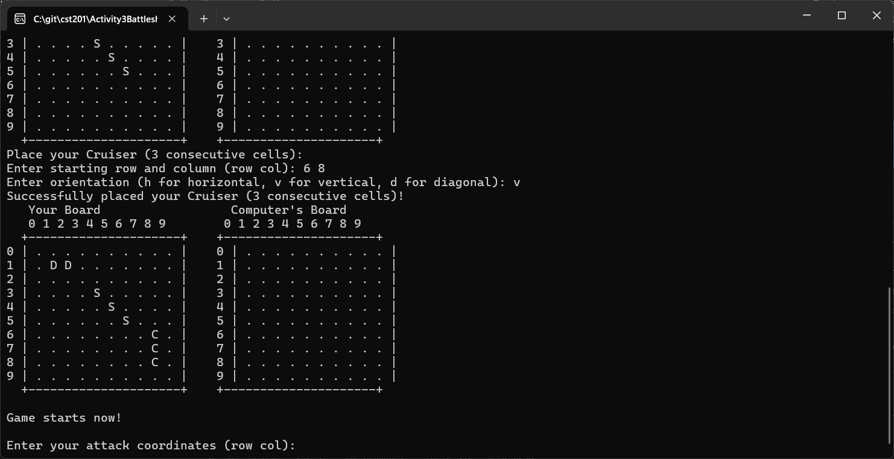

*The player places their ships by entering coordinates and orientation.*

---

### ✅ **3. Player's Turn - Miss**
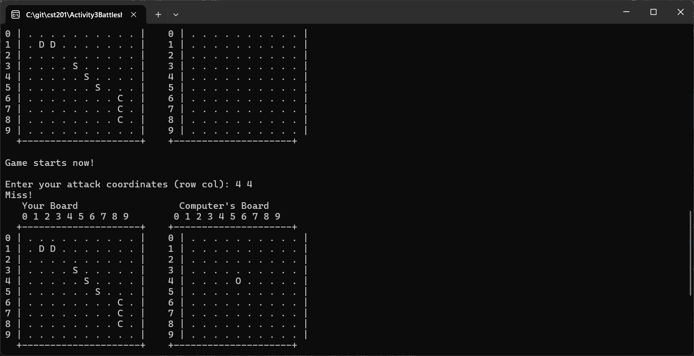

*The player misses their shot.*

---

### ✅ **4. Computer's Turn - Miss**
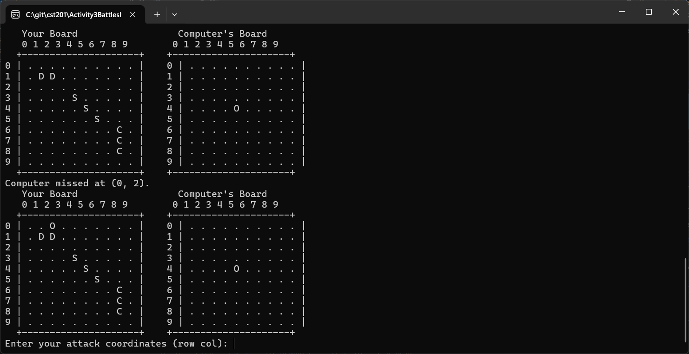

*The computer misses its shot.*

---

### ✅ **5. Computer's TargetOneHit Method (Destroyer)**
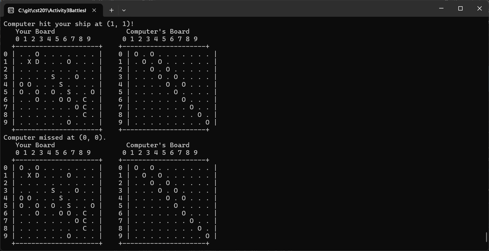

*The computer hits part of the player's Destroyer and begins targeting nearby cells.*

---

### ✅ **6. Computer Sinks Player's Destroyer**
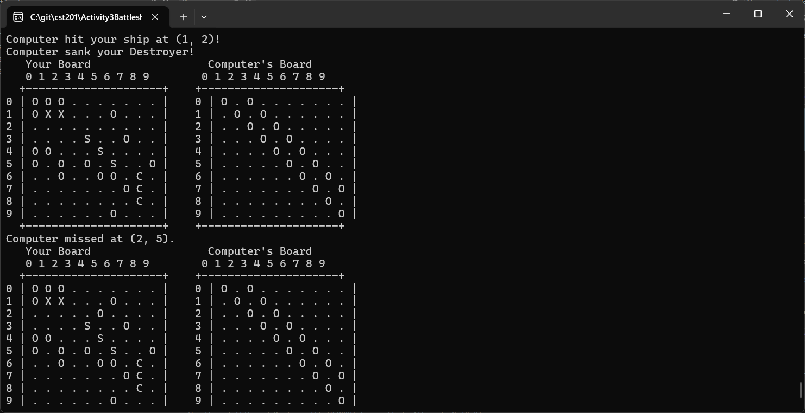

*The computer successfully sinks the player's Destroyer.*

---

### ✅ **7. Computer's TargetOneHit Method (Cruiser)**
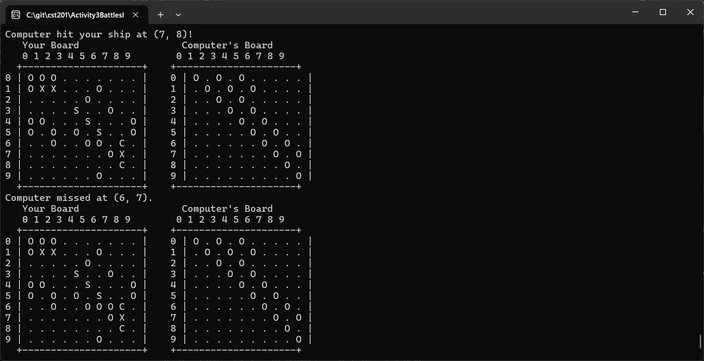

*The computer detects and targets another ship: the Cruiser.*

---

### ✅ **8. Computer's OrientationLocked Method (Cruiser)**


*The computer locks onto the orientation of the Cruiser and continues its attack.*

---

### ✅ **9. Computer Sinks Player's Cruiser**
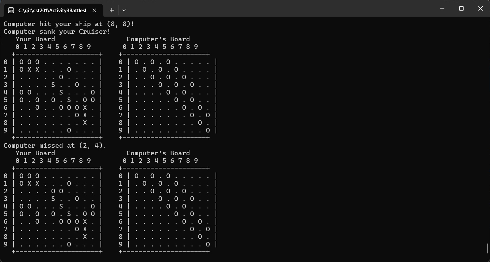

*The computer sinks the player's Cruiser.*

---

### ✅ **10. Player's Turn - Successful Hit**
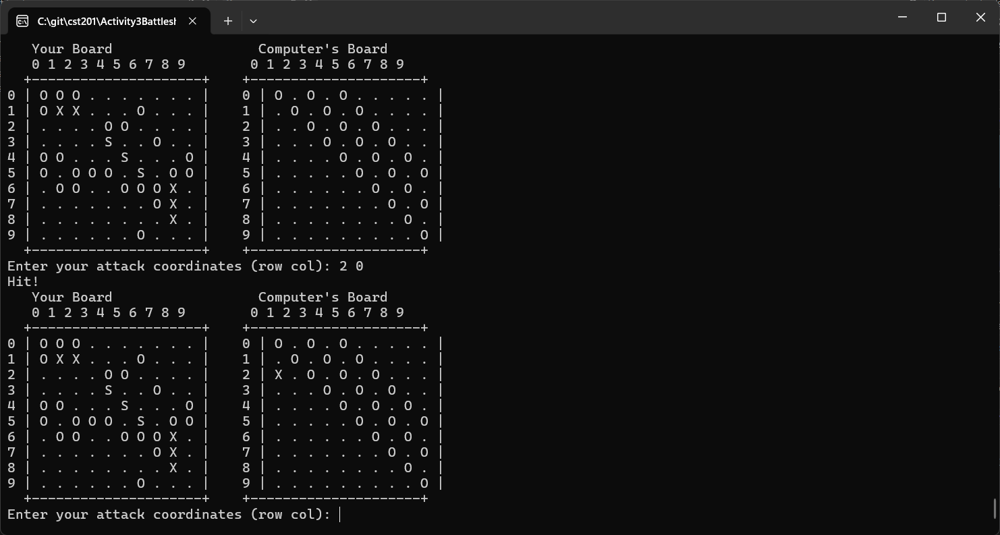

*The player hits one of the computer's ships.*

---

### ✅ **11. Player Sinks a Ship**
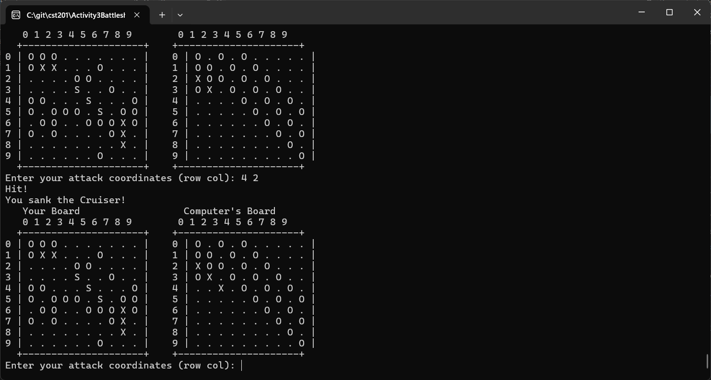

*The player successfully sinks one of the computer's ships.*

---

### ✅ **12. Computer's TargetOneHit Method (Submarine)**
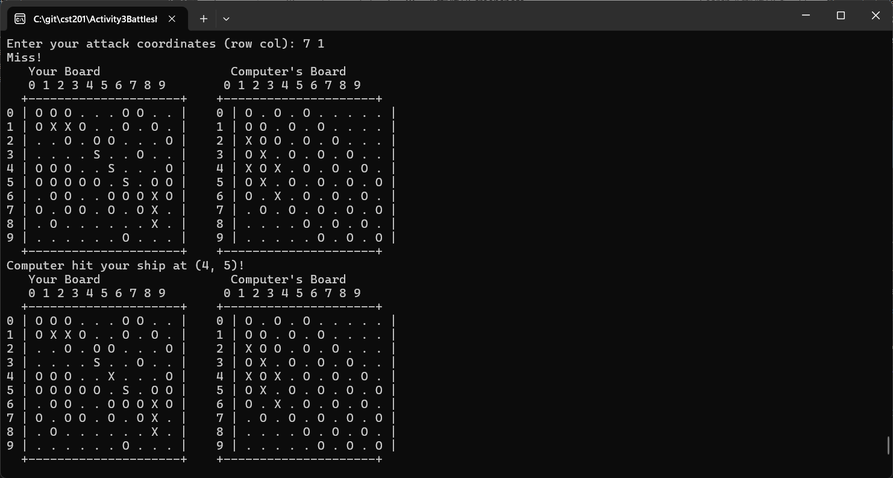

*The computer begins targeting the player's Submarine.*

---

### ✅ **13. Computer's OrientationLocked Method (Submarine)**
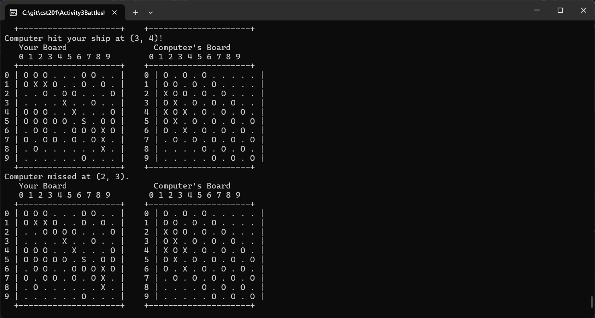

*The computer locks onto the Submarine's orientation for precise attacks.*

---

### ✅ **14. Computer Sinks Submarine and Wins**
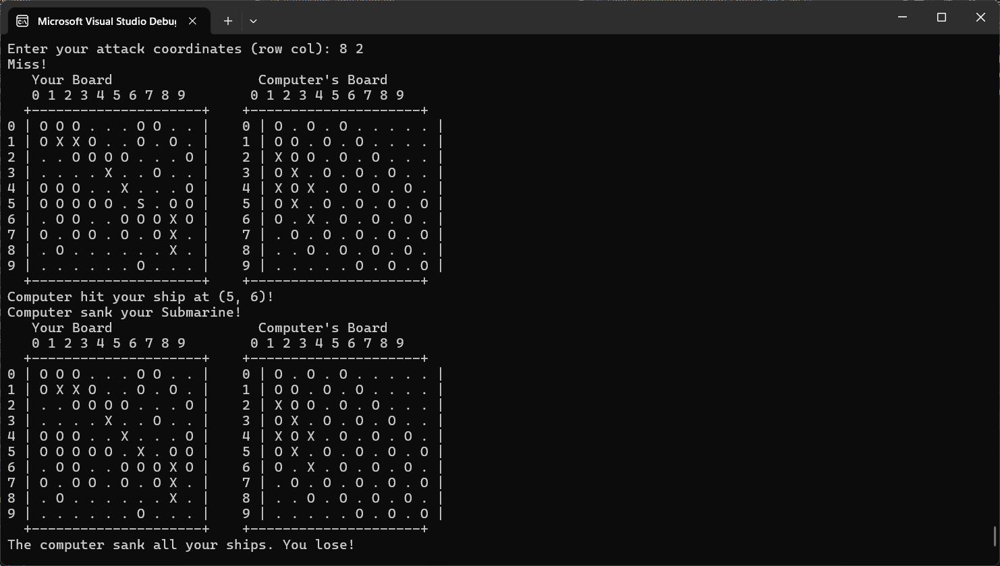

*The computer sinks the player's Submarine and wins the game.*

---

## 📚 **Summary of Key Concepts**
This project demonstrates several important concepts in algorithms and data structures, including:

### 🔑 **1. State-Based AI**
- The computer AI transitions between `Hunt`, `TargetOneHit`, and `OrientationLocked` states to simulate strategic gameplay.

### 🔑 **2. Input Validation**
- Ensures valid inputs for ship placement and attack coordinates, preventing runtime errors.

### 🔑 **3. Dynamic Board Updates**
- The game continuously updates both the player's and computer's boards for real-time feedback.

### 🔑 **4. Recursive AI Logic**
- The AI uses recursive-like logic to intelligently lock onto ships and determine their orientation.

---

## 🔧 **How to Modify the Program**
If you want to expand the program, consider:
- Adding more ship types with varying sizes.
- Introducing difficulty levels for the AI.
- Enhancing the UI with colors or graphical elements.

---
