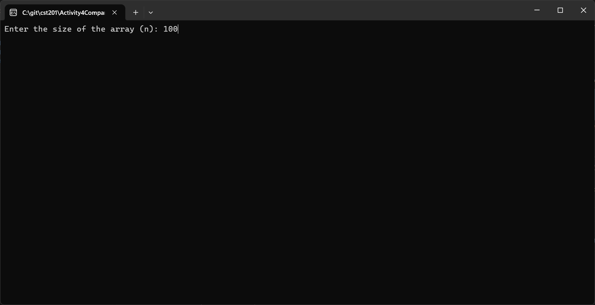
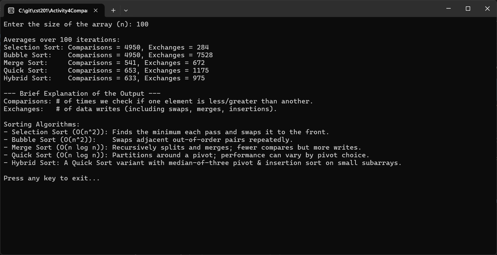

# Activity 4: Sorting Algorithm Comparison

---

# 📝 Cover Sheet  
**Student Name:** Alex Frear  
**Date:** 02/02/2025  
**Program:** College of Science, Engineering, and Technology, Grand Canyon University  
**Course:** CST-201 Algorithms and Data Structures  
**Instructor:** Mohamed Mneimneh  

---

## 🎥 **Screencast Videos**
<div>
    <a href="https://www.loom.com/share/EXAMPLE_VIDEO_LINK">
      <p>CST201 - Sorting Algorithm Comparison - Watch Video</p>
    </a>
    <a href="https://www.loom.com/share/EXAMPLE_VIDEO_LINK">
      
    </a>
</div>

---

# 📋 Sorting Algorithm Comparison

## 📄 **Description**
This program compares different sorting algorithms, including:
- **Selection Sort**
- **Bubble Sort**
- **Merge Sort**
- **Quick Sort**
- **Hybrid Sort** (Quick Sort with median-of-three pivot & Insertion Sort for small subarrays)

Each algorithm sorts a shuffled list of numbers while counting **comparisons** (how many times elements are compared) and **exchanges** (how many times elements are swapped/moved). The program runs each sorting algorithm **100 times** and outputs the average number of comparisons and exchanges.

---

## 📄 **Pseudocode**
### High-Level Overview:
```
1. Read n from user.
2. For iteration in [1..100]:
   a. Create array of size n with values 1..n
   b. Shuffle array (Fisher-Yates)
   c. For each algorithm:
      - Clone the shuffled array
      - Sort while counting comparisons & exchanges
      - Accumulate totals
3. Print average comparisons/exchanges for each algorithm.
```

---

## 📄 **Source Code**
You can view the full source code for this program here:  
🔗 [Program.cs](https://github.com/amfrear/cst201/blob/main/Activity4CompareSorting/SortingComparison/Program.cs)  

---

## 🛠️ **How the Program Works**
1. The user enters the size of the array (`n`).
2. The program generates a list of numbers from `1` to `n` and shuffles it.
3. Each sorting algorithm sorts the shuffled list while tracking:
   - **Comparisons**: Number of element comparisons.
   - **Exchanges**: Number of element swaps or moves.
4. This process repeats **100 times** to obtain an **average**.
5. The results display the efficiency of each algorithm.

---

## 💻 **How to Run the Program**
### Steps:
1. Open the project in **Visual Studio**.
2. Run the program by pressing **F5**.
3. Enter a positive integer for the array size (`n`).
4. View the average comparisons and exchanges after **100 iterations**.

---

## 📸 **Screenshots**

### ✅ **1. Console Prompt**


*User is prompted to enter the array size.*

---

### ✅ **2. Sorting Results & Explanation**


*The program displays the average number of comparisons and exchanges for each sorting algorithm.*

---

## 📚 **Summary of Key Concepts**
This program demonstrates several key concepts in **Algorithms and Data Structures**:

### 🔑 **1. Sorting Complexity**
- **Selection Sort & Bubble Sort (O(n²))**: Slow for large `n` but simple.
- **Merge Sort & Quick Sort (O(n log n))**: Faster due to divide-and-conquer strategy.
- **Hybrid Sort** optimizes Quick Sort by using **median-of-three pivot selection** and **Insertion Sort for small partitions**.

### 🔑 **2. Performance Metrics**
- **Comparisons**: How often two elements are compared.
- **Exchanges**: How often elements are moved/swapped.
- Some algorithms do **fewer comparisons but more exchanges** (e.g., Merge Sort), while others do **more comparisons but fewer swaps** (e.g., Selection Sort).

---

## 🔧 **How to Modify the Program**
Potential improvements include:
- Adding **Heap Sort** or **Shell Sort** for further comparisons.
- Allowing **user-defined iteration counts**.
- Implementing **graphical data visualization** for sorting metrics.

---
