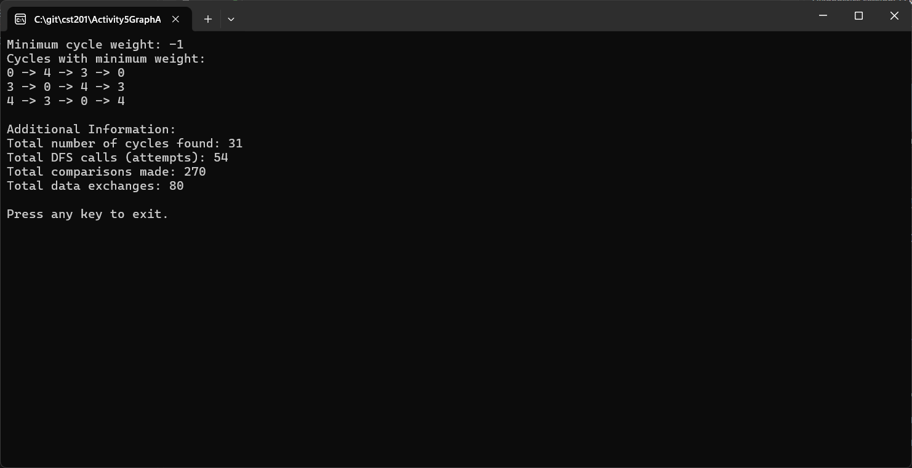

# Activity 5: Graph Cycle Finder

---

# 📝 Cover Sheet  
**Student Name:** Alex Frear  
**Date:** 02/10/2025  
**Program:** College of Science, Engineering, and Technology, Grand Canyon University  
**Course:** CST-201 Algorithms and Data Structures  
**Instructor:** Mohamed Mneimneh  

---

## 🎥 **Screencast Video**
<div>
    <a href="https://www.loom.com/share/34e9135de46144b5af813be8c31b8b89">
      <p>CST201 - Activity 5 Graph Algorithms - Watch Video</p>
    </a>
    <a href="https://www.loom.com/share/34e9135de46144b5af813be8c31b8b89">
      
    </a>
  </div>

---

# 📋 Graph Cycle Finder

## 📄 **Description**
This program analyzes a **directed graph** with **weighted edges (including negative weights)** to:
- **Find all cycles in the graph** where no edge is reused.
- **Determine the cycle(s) with the minimum weight.**
- **Track the number of comparisons, DFS calls, and data exchanges** for performance analysis.

The program uses **Depth-First Search (DFS)** to explore paths, detect cycles, and track their weights.  

---

## 📄 **Pseudocode**
### **Cycle Detection Using DFS**
```
1. Initialize a weight matrix W representing the directed graph.
2. Set minCycleWeight to ∞ and an empty list minCycles.
3. For each vertex v:
   a. Start DFS from v with an empty path.
   b. For each reachable neighbor u:
      - If (v, u) was not used before in this path, explore further.
      - If u == start and path length > 1, cycle detected.
      - Track minimum cycle weight and store cycles.
   c. Backtrack to allow other paths to be explored.
4. Output minCycleWeight and all cycles with that weight.
5. Display total DFS calls, comparisons, and data exchanges.
```

---

## 📄 **Source Code**
You can view the full source code for this program here:  
🔗 [Program.cs](https://github.com/amfrear/cst201/blob/main/Activity5GraphAlogorithms/GraphCycleFinder/Program.cs)  

---

## 🛠️ **How the Program Works**
1. **Graph Representation:** The program uses a **weight matrix** where `float.PositiveInfinity` represents missing edges.
2. **Cycle Search with DFS:**  
   - Starts from each vertex and explores paths recursively.
   - Tracks visited edges to **prevent reuse within a single cycle**.
3. **Finding Minimum Weight Cycles:**  
   - If a cycle is detected, its weight is compared to the **current minimum**.
   - If lower, the cycle list is replaced. If equal, it's added.
4. **Performance Tracking:**  
   - **DFS Calls:** Counts total recursive calls.
   - **Comparisons:** Counts neighbor checks.
   - **Data Exchanges:** Tracks list insertions/removals.

---

## 💻 **How to Run the Program**
### **Steps:**
1. Open the project in **Visual Studio**.
2. Run the program by pressing **F5**.
3. The program will output:
   - The **minimum weight cycle**.
   - All cycles with that weight.
   - Additional performance statistics.

---

## 📸 **Screenshot of Program Output**
### ✅ **Console Output**


---

## 📚 **Complexity Analysis**
### 🔑 **Time Complexity**
- **DFS Traversal:** \(O(V + E)\) per DFS call.
- **Cycle Enumeration:** Exponential worst-case \(O(2^V)\) due to backtracking.
- **Total Complexity:** Between **\(O(VE)\)** and **\(O(2^V)\)**, depending on graph structure.

### 🔑 **Space Complexity**
- **\(O(V + E)\)** for storing paths and visited edges.

---

## 🔧 **Possible Enhancements**
- **Use Bellman-Ford** to detect negative-weight cycles efficiently.
- **Improve cycle enumeration** using **Johnson’s Algorithm** (\(O(VE + V \log V)\)).
- **Implement early pruning** to stop DFS when path weight exceeds `minCycleWeight`.

---
