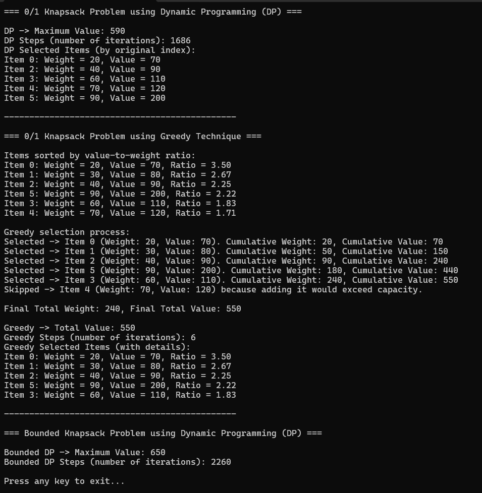

# Activity 6: Greedy Technique

---

# 📝 Cover Sheet  
**Student Name:** Alex Frear  
**Date:** 02/22/2025  
**Program:** College of Science, Engineering, and Technology, Grand Canyon University  
**Course:** CST-201 Algorithms and Data Structures  
**Instructor:** Mohamed Mneimneh  

---

## 🎥 **Screencast Video**

    <a href="https://www.loom.com/share/4ef1829047894ac2ae9175f00d76f8b4">
      
CST201 - Activity6GreedyTechnique - Video - Watch Video

    </a>
    
  

---

# 📋 Knapsack Problem

## 📄 **Description**
This program solves the **Knapsack Problem** using:
1. **0/1 Dynamic Programming (DP)**
2. **Greedy Technique** (value-to-weight ratio)
3. **Bounded Knapsack DP** (when multiple copies of items are allowed)

The code demonstrates how to:
- **Find the optimal set of items** to maximize total value without exceeding the knapsack’s capacity.  
- **Compare** the performance and outcome of **DP vs. Greedy**.  
- **Handle bounded quantities** for each item.

---

## 📄 **Pseudocode & Algorithm Summaries**

### **0/1 Dynamic Programming**
1. Create a 2D DP array `dp[n+1][capacity+1]`.
2. For each item `i` in `1..n`:
   - For each weight `w` in `0..capacity`:
     - If `weights[i-1] <= w`:
       - `dp[i][w] = max(dp[i-1][w], dp[i-1][w - weights[i-1]] + values[i-1])`
     - Else:
       - `dp[i][w] = dp[i-1][w]`
3. The answer is `dp[n][capacity]`.

### **Greedy Approach (0/1)**
1. Calculate value-to-weight ratio for each item.
2. Sort items in **descending order** by this ratio.
3. Start selecting items in that order, **as long as** total weight does not exceed the capacity.
4. This yields an optimal solution for **fractional** knapsack but may be **suboptimal** for 0/1 knapsack.

### **Bounded Knapsack (DP)**
1. Use a 1D array `dp[capacity+1]` initialized to 0.
2. For each item `i`:
   - For each copy `c` in `0..quantities[i]-1`:
     - For `w` from `capacity` down to `weights[i]`:
       - `dp[w] = max(dp[w], dp[w - weights[i]] + values[i])`
3. The result is `dp[capacity]`.

---

## 📄 **Source Code**
You can view the full source code for this program here:  
🔗 [Program.cs](https://github.com/amfrear/cst201/blob/main/Activity6GreedyTechnique/KnapsackExample/Program.cs)  

---

## 🛠️ **How the Program Works**

1. **Inputs**:  
   - A **knapsack capacity** (e.g., 280).  
   - A set of items with **weights** (e.g., `{20, 30, 40, 60, 70, 90}`) and **values** (e.g., `{70, 80, 90, 110, 120, 200}`).  
   - (For bounded version) An array of **quantities** (e.g., `{1, 2, 1, 3, 1, 2}`).

2. **0/1 DP**:  
   - Fills a 2D DP table to guarantee the **optimal** combination for the single‐copy (0/1) scenario.  
   - Tracks the number of steps (inner-loop iterations) for complexity analysis.

3. **Greedy**:  
   - Sorts items by **value/weight** ratio.  
   - Picks items while capacity allows.  
   - **Does not always produce the optimal** total value for 0/1 knapsack but runs faster (fewer steps).

4. **Bounded DP**:  
   - Similar to 0/1 DP but allows multiple copies of each item (up to the specified quantity).  
   - Produces the **optimal** solution in that scenario.

5. **Outputs**:  
   - **Maximum Value** found by each method.  
   - **Selected Items** (for DP and Greedy) to show how “Value” is computed.  
   - **Step Counts** to illustrate complexity.

---

## 💻 **How to Run the Program**
### **Running the Program in Visual Studio**
1. Clone or download the project repository.
2. Open **Visual Studio** and load the solution (`.sln` file).
3. Press **F5** to build and run the project.
4. The program will execute and display:
   - Maximum value computed by each method.
   - Items selected in the optimal solution.
   - Step count for complexity comparison.

---

## 📸 **Screenshot of Program Output**
### ✅ **Console Output**
 

---

## 📚 **Complexity Analysis**

### 🔑 **0/1 Dynamic Programming**
- **Time Complexity:** \(O(n \times \text{capacity})\).  
- **Space Complexity:** \(O(n \times \text{capacity})\) for the 2D table (though can be optimized to 1D).

### 🔑 **Greedy Approach (0/1)**
- **Time Complexity:** \(O(n \log n)\) due to sorting, plus \(O(n)\) for item selection.  
- **Space Complexity:** \(O(n)\) for storing item data.

### 🔑 **Bounded Knapsack (DP)**
- **Time Complexity:** \(O\big(\sum (quantities[i]) \times \text{capacity}\big)\).  
- **Space Complexity:** \(O(\text{capacity})\) if using a 1D DP array.

---

## 🔧 **Possible Enhancements**
- **Item Reconstruction**: Provide a more detailed breakdown of selected items (especially in Bounded DP).  
- **Optimization**: Use **binary-splitting** or **unbounded** knapsack techniques if item limits are large.  
- **Memory Optimization**: Convert 2D DP to 1D rolling array for 0/1 DP to save space.  

---