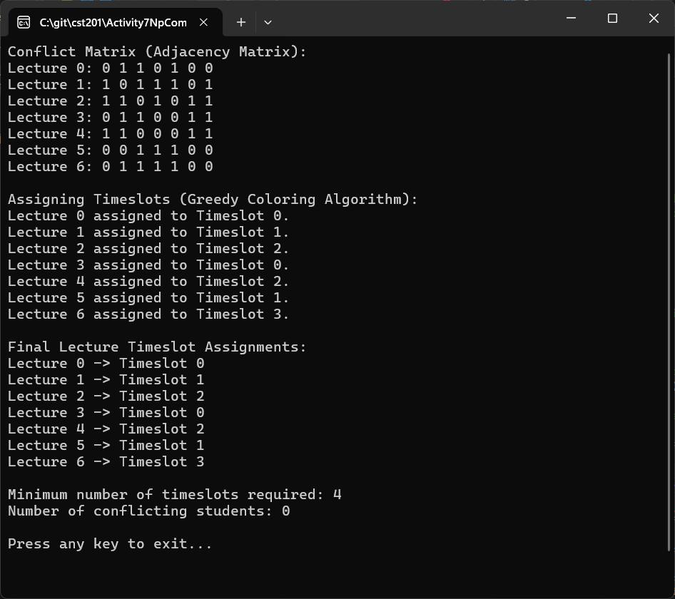

# Activity 7: NP - Complete Problems

---

# 📝 Cover Sheet  
**Student Name:** Alex Frear  
**Date:** 03/02/2025  
**Program:** College of Science, Engineering, and Technology, Grand Canyon University  
**Course:** CST-201 Algorithms and Data Structures  
**Instructor:** Mohamed Mneimneh  

---

## 🎥 **Screencast Video**

    <a href="YOUR_LOOM_VIDEO_LINK_HERE">
      
CST201 - Activity 7 Lecture Scheduling - Watch Video

    </a>
    

---

# 👋 Lecture Scheduling Using Graph Coloring

## 📄 **Description**
This program schedules university lectures into timeslots while ensuring that:
- No two lectures with a **shared student** occur at the same time.
- The **minimum number of timeslots** is used for scheduling.
- The program detects **any scheduling conflicts** where a student is assigned to overlapping lectures.

This problem is modeled as a **Graph Coloring Problem**, where:
- **Lectures = Nodes**
- **Shared Students = Edges**
- **Timeslots = Colors**

A **greedy coloring algorithm** assigns timeslots to lectures by minimizing conflicts.

---

## 📄 **Pseudocode**
### **Graph Coloring Algorithm (Greedy Heuristic)**
1. Define an adjacency matrix A where `A[i][j] = 1` if lectures `i` and `j` share students.
2. Create an array `colors` initialized to `-1` (unassigned timeslots).
3. Assign the first lecture (node) to color `0`.
4. For each remaining lecture:  
   a. Find the smallest available color that does not conflict with already assigned lectures.  
   b. Assign the color to the lecture.
5. Count the total number of timeslots used.
6. Check for conflicts by verifying that no two adjacent lectures share the same timeslot.
7. Print the lecture schedule and the number of conflicting students.

---

## 📄 **Source Code**
You can view the full source code for this program here:  
🔗 [Program.cs](https://github.com/amfrear/cst201/blob/main/Activity7NpCompleteProblems/LectureScheduling/Program.cs)  

---

## 🛠️ **How the Program Works**
1. **Conflict Matrix Input:**  
   - A **7x7 adjacency matrix** represents which lectures share students.
   - A **"1"** in matrix position `[i, j]` means lecture `i` and lecture `j` have at least one shared student.
   - A **"0"** means no conflict.

2. **Greedy Graph Coloring Algorithm:**  
   - Assigns timeslots to each lecture.
   - Ensures no two lectures sharing a student are scheduled at the same time.

3. **Checking for Conflicts:**  
   - If a student is double-booked, the program counts the conflicts.

4. **Final Output:**  
   - Displays assigned timeslots.
   - Shows the **minimum number of timeslots used**.
   - Displays the **number of conflicting students (should be 0)**.

---

## 💻 **How to Run the Program**
### **Steps:**
1. Open the project in **Visual Studio**.
2. Copy the source code into **Program.cs**.
3. Press **F5** to run the program.
4. The program will output:
   - **Conflict Matrix**
   - **Lecture-to-Timeslot Assignments**
   - **Minimum number of timeslots required**
   - **Number of conflicting students**

---

## 📸 **Screenshot of Program Output**
### ✅ **Console Output**

---

## 📚 **Complexity Analysis**
### 🔑 **Time Complexity**
- **Greedy Coloring:** \(O(V^2)\) (since we check all previous nodes for color conflicts)
- **Conflict Checking:** \(O(V^2)\) (double-loop to check adjacency)
- **Overall Complexity:** \(O(V^2)\)  

### 🔑 **Space Complexity**
- **Adjacency Matrix:** \(O(V^2)\) (stores student conflicts)
- **Colors Array:** \(O(V)\) (stores timeslot assignments)
- **Overall Space Complexity:** \(O(V^2)\)

---

## 🔧 **Possible Enhancements**
- **Improve Algorithm:** Use **Backtracking** or **Welsh-Powell Algorithm** for a more optimal solution.
- **User Input:** Allow users to enter their own **conflict matrix**.
- **GUI Version:** Implement a simple UI to visualize lecture schedules.

---